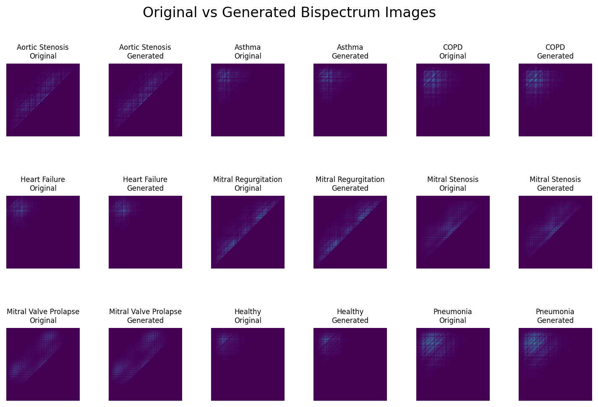
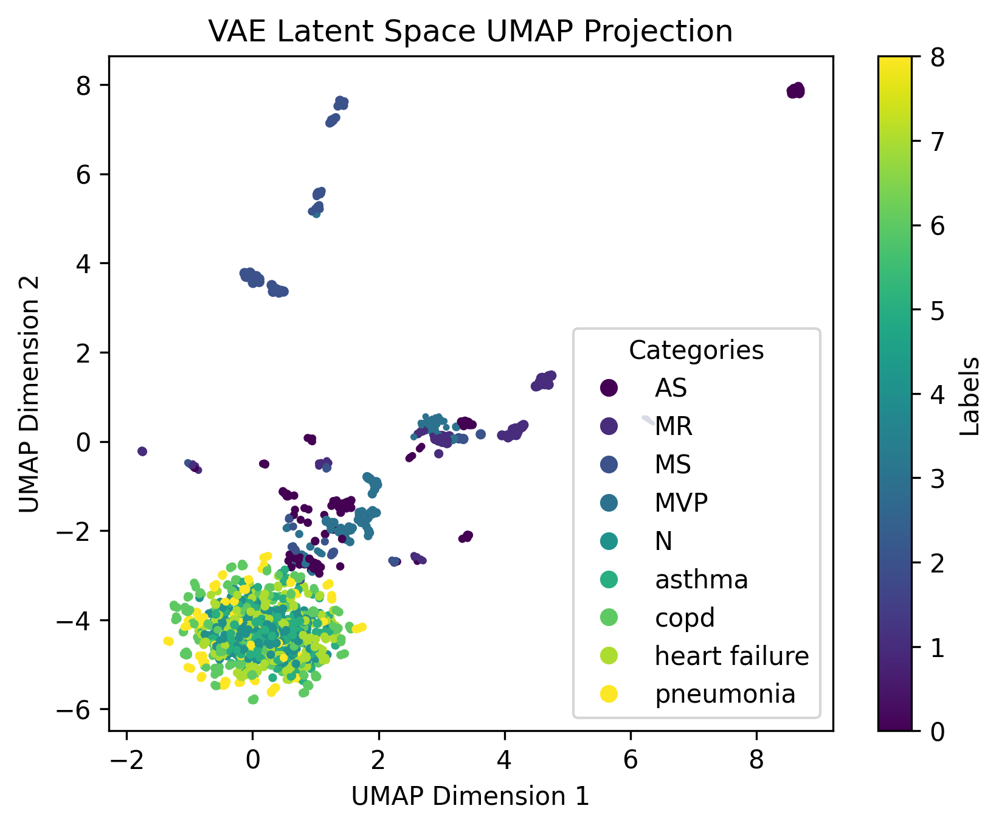

# Remote Stethoscope Diagnosis Assistant

## Disclaimer
#### This product is intended for research and educational purposes. This product is in no way a replacement for professional medical diagnosis, treatment, or advice. The model is designed to assist qualified medical professionals in making educated medical decisions, not for individual patients to self-diagnose. Note that this model may produce incorrect or incomplete results, and I make no guarantees regarding its reliability in practice. I accept no liability for any harm or consequences resulting from the use or misuse of this tool. Commercial use of this model is not permitted without explicit written permission.

## Introduction
#### This project develops a machine learning model to analyze and predict audio recorded with a remote stethoscope. By combining real data with synthetic data generated using a variational autoencoder, the prediction model is able to achieve a higher level of performance. The system is designed to detect nine different conditions: healthy, asthma, aortic stenosis, mitral regurgitation, mitral stenosis, mitral valve prolapse, COPD, heart failure, and pneumonia.

## Setup and Use
#### To create predictions using the model, make sure you have installed the required dependencies here:
- Python
- torch
- torchaudio
- scipy
- numpy

#### The model is run using the predict.py script in the src folder. This script takes one argument passed in with the flag --d, the path to the folder containing the WAV files on which to make predictions. To run the script for the folder test_audio_files in the project root directory, use the command:
#### ```python .\predict.py --d ../test_audio_files```

#### The prediction for each file in the test_audio_files folder will then be printed to the terminal. Note that this will fail if non-WAV files are included in the test_audio_files folder.

## Data Preparation and Modelling
#### The audio data is first resampled to 4000 Hz and filtered with a second-order Butterworth bandpass filter with upper and lower cut-off frequencies of 400 and 25 Hz before being split into segments of 1000 items, corresponding to 2 seconds of audio. Then, each audio segment is transformed into a (1, 256, 256) bispectrum image to capture the nonlinear relationships within the data. The dataset is split into 200 training examples, 20 validation examples, and 40 test examples per class. The variational autoencoder is trained to reproduce the bispectrum images from their inputs in the training set using k-fold cross-validation for hyperparameter tuning. The training set is then upsampled by adding generated images until each class in the training set has 800 examples. Finally, a convolutional neural network is trained on the augmented training set to classify the input image into its corresponding class. The convolutional neural network hyperparameters are tuned on the validation set before a final evaluation is done on the test data.

#### Comparison between original and generated samples for each class.



#### Variational autoencoder and convolutional neural network training losses.


## Performance
#### The model demonstrates strong overall classification performance. Key metrics are shown below.

#### Precision: 0.837
#### Recall:    0.789
#### F1-Score:  0.779
#### Accuracy:  0.789

#### A confusion matrix is also shown for the test set predictions.


#### To further analyze the behavior of the variational autoencoder, images are encoded to their latent representations and mapped to a lower-dimensional space using UMAP. These low-dimensional data points can then be plotted to visualize the patterns that the variational autoencoder has learned. 2D and 3D plots are available here.



[View 3D UMAP Visualization Here](plots/3d_UMAP_plot.html)

## Citations

- Zhang, M., Li, M., Guo, L., & Liu, J. (2023). A Low-Cost AI-Empowered Stethoscope and a Lightweight Model for Detecting Cardiac and Respiratory Diseases from Lung and Heart Auscultation Sounds. Sensors, 23(5), 2591. https://doi.org/10.3390/s23052591
- Yaseen, Son, G.-Y., & Kwon, S. (2018). Classification of Heart Sound Signal Using Multiple Features. Applied Sciences, 8(12), 2344. https://doi.org/10.3390/app8122344
- Fraiwan, L., Hassanin, O., Fraiwan, M., Khassawneh, B., Ibnian, A. M., & Alkhodari, M. (2021). Automatic identification of respiratory diseases from stethoscopic lung sound signals using ensemble classifiers. Biocybernetics and Biomedical Engineering, 41(1), 1-14. https://www.sciencedirect.com/science/article/abs/pii/S0208521620301297